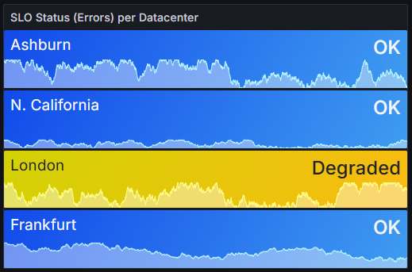
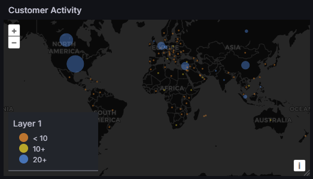
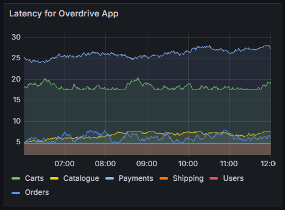

# 🚀 Extreme Dashboard Makeover

Overcharge’s dashboards aren’t keeping up with their high-speed operations. In this lab, you'll upgrade a real-world dashboard that’s hard to read, lacks visual clarity, and doesn’t highlight what matters most.

You’ll learn how to turn noisy charts into sharp, focused visualizations—so teams can spot issues early, respond quickly, and keep things running smoothly. Better dashboards mean fewer surprises, faster decisions, and a lot less fire-fighting. 🔥🧯

<table style="max-width: 800px; width: 100%;">
   <tr>
      <td style="width: 50%; vertical-align: top;">
         <strong>Before:</strong><br>
         
      </td>
      <td style="width: 50%; vertical-align: top;">
         <strong>After:</strong><br>
         
      </td>
   </tr>
</table>

## Introduction

Your Killercoda environment comes pre-configured with the Overcharge SRE dashboard, which displays essential monitoring metrics like:

* RED metrics (Request rates, Error rates, and Duration/latency)
* Kubernetes pod status information
* User activity from a geographic perspective

While this dashboard contains valuable information, it's not optimized for quick understanding or visual appeal. Throughout this lab, we'll enhance each panel to make the information more accessible, meaningful, and actionable.

**Our goal**: Transform raw data into visual insights that tell a story at a glance.

## Revamp the 'Error Rates' Panel: From Timeline to Instant Status

<table style="max-width: 800px; width: 100%;">
   <tr>
      <td style="width: 50%;">
         <strong>Before:</strong><br>
         
      </td>
      <td style="width: 50%;">
         <strong>After:</strong><br>
         
      </td>
   </tr>
</table>

### Why make this change?

The original time series graph shows error rates over time, but it has several problems:
- The scale makes it difficult to see small but important variations
- It doesn't clearly indicate what error levels are acceptable or problematic
- It requires interpretation to understand current status

By converting to a stat panel with color-coded thresholds, we create an instantly understandable visual indicator that shows:
- Current error status at a glance
- Clear categorization of error states (OK, Degraded, SLO Violation)
- Immediate understanding of service health without needing to interpret a graph

### Instructions:

1. Edit the *Error Rates* panel (hover over the panel's title, click on the three vertical dots at the top right, and then click *Edit*)

2. Change the Visualization type
    - At the top right, switch the Visualization Type from *Time Series* to *Stat*
    
3. Change the style, under *Stat styles*:
    - **Tip:** Use the search bar at the top of the panel editor to quickly find options
    - Change *Orientation* from Auto to Horizontal
    - Change *Color Mode* from Value to Background Gradient

4. Under *Standard Options*, delete the Max value of 100. This allows the panel to auto-scale based on the data, which is more flexible for different error rates.
    
5. Add context with value mappings:
    - Expand the 'Value Mappings' section and then click *Add value mappings*
    - Click on the trash icon 🗑 to remove that empty default mapping
    - Click *Add a New Mapping* and then *Range*. Set range from 0 to 1 with Display Text of *OK*. Set color to Blue
    - Click *Add a New Mapping* and then *Range*. Set range from 1 to 2 with Display Text of *Degraded*. Set color to Yellow
    - Click *Add a New Mapping* and then *Range*. Set range from 2 to 100 (or more) with Display Text of *SLO Violation*. Set color to Orange
    - Click on *Back to dashboard*

    The value mapping settings should look like this:

    

6. Change the Panel Title to *SLO Status(Errors) per Data Center*
    - Search for Title, or clear your search, it will be the first option

7. Save the dashboard by clicking the "Save as copy" button in the upper right corner of the dashboard. This will create a new version of the dashboard with your changes. Name your dashboard "Overcharge SRE Dashboard". You may also update the description if you wish. Click the "Save" button to confirm. All the rest of steps will be done on this new dashboard.

8. After saving the dashboard, click on the "⬅️ Back to dashboard" button in the upper right corner. This will put you back on the main dashboard where you can edit the next panel.

> 💡 **Tip:** Grafana dashboards are versioned. Saving frequently makes it easier to track changes and revert if needed.

## Transform the 'K8s Service Status' Panel: From Dense Table to Visual Status Board

<table style="max-width: 800px; width: 100%;">
   <tr>
      <td style="width: 50%;">
         <strong>Before:</strong><br>
         
      </td>
      <td style="width: 50%;">
         <strong>After:</strong><br>
         
      </td>
   </tr>
</table>

### Why make this change?

The original table format has several limitations:
- It's text-heavy and requires careful reading to interpret
- Status values (0 or 1) aren't immediately meaningful to viewers
- It takes up valuable dashboard space with repetitive information

By transforming it into a stat panel with visual indicators, we:
- Create an at-a-glance view of container status
- Use color coding for immediate status recognition (blue for UP, orange for DOWN)
- Focus only on the essential information (container name and status)
- Make problems immediately visible without requiring detailed analysis

### Instructions:

1. Edit the *K8s Service Status* panel (hover over the panel's title, click the three vertical dots to show the context menu, and then click *Edit*)

2. Switch the Visualization Type from *Table* to *Stat*

3. In the Value options, change *Show* to All values

4. Change the *Color mode* to Background Solid

5. Change the Thresholds colors and value:
    * For the Base threshold, change the color to Orange by clicking on the green circle
    * Change the existing threshold to 1 and the color to blue

6. Change the *value mappings*:
    * Add a Value mapping, setting the value condition to 1, and the display text to *UP*
    * Add a second Value mapping, condition 0 and display text *DOWN*

7. Clean up the display with transformations:
    - On the left side, under the visualization, click on *Transformations* -> *Add transformation*
    - Search for *Organize fields*
    - Hide unnecessary fields by clicking on the eye icon next to each field name. Hide all fields except *Value* and *container*. The panel should now look like the "after" image above, with clear visual indicators for container status.

8. Save the dashboard by clicking the "Save dashboard" button in the top bar, on the right side

## Visualize the 'Customer Activity' Panel: From Abstract Stats to Geographic Insights

<table style="max-width: 800px; width: 100%;">
   <tr>
      <td style="width: 50%;">
         <strong>Before:</strong><br>
         
      </td>
      <td style="width: 50%;">
         <strong>After:</strong><br>
         
      </td>
   </tr>
</table>

### Why make this change?

The original stat panel presents geographic data in a non-geographic way:
- It displays country codes and hit counts as abstract numbers
- It fails to convey the spatial relationships between user locations
- It makes patterns and regional hotspots nearly impossible to identify

By converting to a geomap visualization, we:
- Create an intuitive representation of geographic data
- Enable immediate identification of high-traffic regions
- Make patterns visible through marker size and color intensity
- Transform raw numbers into an actionable geographic intelligence

### Instructions:

1. Edit the *Customer Activity* panel (hover over the panel's title, click the three vertical dots to show the context menu, and then click *Edit*)

2. Switch the Visualization Type from *Stat* to *Geomap*

3. Configure the map markers:
   - Using the search options in the top right, locate the existing layer under *Map layers*, labeled "Layer 1 *markers*"

4. Connect the geographic data:
   - Under *Location Mode*, click *Lookup*
   - For *Lookup Field*, select *geoip_country_code*
   - You should now see data points appearing on the map

5. Make the visualization more informative:
   - Under Styles, change Size from *Fixed Value* to *Value #Hits by geolocation*
   - This makes busier locations have larger markers, creating visual emphasis

6. Add color variation for better insight:
   - Change Color from *Fixed color* to *Value #Hits by geolocation*
   - This creates a heat map effect, with color intensity indicating activity levels

7. Save the dashboard by clicking the "Save dashboard" button in the top bar, on the right side. Add an optional note, then press "Save".


## Enhance the 'Latency for Overcharge App' Panel: Improving Visual Distinction

<table style="max-width: 800px; width: 100%;">
   <tr>
      <td style="width: 50%;">
         <strong>Before:</strong><br>
         
      </td>
      <td style="width: 50%;">
         <strong>After:</strong><br>
         
      </td>
   </tr>
</table>

### Why make this change?

The original latency panel has functional issues that hinder interpretation:
- Multiple blue lines with similar shades make it difficult to distinguish between services
- Thin lines can be hard to follow, especially when they cross
- The fill under the lines creates visual clutter rather than clarity

By enhancing the visual distinction, we:
- Use contrasting colors to immediately differentiate between services
- Make lines thicker for better visibility and tracking
- Remove the fill to focus on the trend lines themselves
- Enable quicker identification of specific service performance issues

### Instructions:

1. Edit the *Latency for Overcharge App* panel (hover over the panel's title, click the three vertical dots to show the context menu, and then click *Edit*)

2. Improve line differentiation:
   - From the dashboard view, click on the blue line associated with Orders in the legend
   - From the color options that appear, select Purple to create clear visual separation
   - Under *graph styles*, increase the *Line width* to 2 for better visibility
   - Set the *Fill opacity* to 0 to remove distracting background fills

3. Save the dashboard by clicking the "Save dashboard" button in the top bar, on the right side. Add an optional note, then press "Save".

## Transform the 'Server Request Rates' Panel: From Trend Graph to Actionable Gauge

<table style="max-width: 800px; width: 100%;">
   <tr>
      <td style="width: 50%;">
         <strong>Before:</strong><br>
         
      </td>
      <td style="width: 50%;">
         <strong>After:</strong><br>
         
      </td>
   </tr>
</table>

### Why make this change?

The original time series graph shows historical request rates, but has limitations:
- It doesn't clearly indicate when values become concerning
- It requires mental processing to determine current status
- The trends take up space without adding immediate decision-making value

By converting to a bar gauge with thresholds, we:
- Create an immediate visual indicator of current load levels
- Establish clear thresholds for normal, elevated, and concerning request rates
- Enable operators to quickly identify when intervention might be needed
- Add visual interest with the retro LCD style while maintaining functionality

### Instructions:

1. Edit the *Server Request Rates* panel (hover over the panel's title, click the three vertical dots to show the context menu, and then click *Edit*)

2. Switch the Visualization Type from *Time Series* to *Bar Gauge*

3. Improve clarity with a better title:
   - Change the Panel Title to *Server Request Rates per Second* (adding "per Second" clarifies the measurement unit)

4. Configure the bar gauge appearance:
   - Under *Bar Gauge*, change Orientation (Layout Orientation) from Auto to Horizontal
   - Change Display Mode from *Gradient* to *Retro LCD* for better visual distinction

5. Add meaningful thresholds to indicate performance boundaries:
   - Under Thresholds, change the base color from Green to Blue for normal operation
   - Change the 2nd threshold color from Red to Yellow and set the level to 45 (warning level)
   - Add a third threshold level at 55, with color set to Orange (critical level)

6. Save the dashboard by clicking the "Save dashboard" button in the top bar, on the right side. Add an optional note, then press "Save".

## Add Your Company Logo: Creating Professional Branding

<table style="max-width: 800px; width: 100%;">
   <tr>
      <td style="width: 50%;">
         <strong>Before:</strong><br>
         
      </td>
      <td style="width: 50%;">
         <strong>After:</strong><br>
         
      </td>
   </tr>
</table>

### Why make this change?

Adding your company logo to dashboards provides several benefits:
- Creates a professional, branded appearance
- Provides immediate visual identification of your monitoring ecosystem
- Establishes context for viewers about who owns/maintains the dashboard
- Makes screenshots and shared views instantly recognizable

### Instructions:

1. In the dashboard, click on the _Add_ button, then select _Visualization_

2. Switch the visualization type:
   - On the right panel, click on the default "Time Series" visualization
   - Search for 'Text' and select the *Text* panel

3. Configure for HTML content:
   - For _mode_ in the bottom right, switch from Markdown to HTML
   - Remove the default text and paste in the following HTML:

    ```html
    <center></center>
    ```

4. Optimize the appearance:
   - Remove the Panel Title (clear the title field)
   - Toggle _Transparent Background_ to enabled for seamless integration

5. Save the dashboard by clicking the "Save dashboard" button in the top bar, on the right side

6. Size and position the logo panel appropriately on your dashboard

## Final Step: Arrange Your Panels for Optimal Layout


### Why make this change?

The arrangement of panels is as important as their content:
- Logical grouping helps users find related information quickly
- Proper sizing ensures important metrics get appropriate emphasis
- Good spacing improves readability and reduces visual clutter
- Thoughtful organization creates a natural information flow

### Instructions:

1. Click and drag panels to reposition them on the dashboard

2. Resize panels by clicking and dragging their corners or edges

3. Consider these layout principles:
   - Place the most critical information at the top or in the upper left (where eyes naturally go first)
   - Group related metrics near each other
   - Ensure sufficient space between panels for visual separation
   - Size panels according to their importance and information density

4. Save your final dashboard when you're satisfied with the layout

Congratulations! You've transformed a basic dashboard into an informative, visually appealing monitoring tool that communicates insights at a glance.
